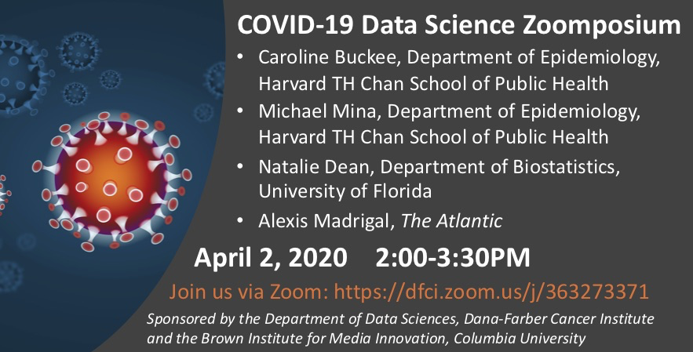

## COVID-19 Data Science Symposium

After having to postpone our 2020 Zelen Symposium to September 30,  co-organizer [Mark Hansen](https://twitter.com/cocteau) suggested we organize and host an online COVID-19 symposium instead. The event was held on April 2, 2020. Here we provide a summary and materials shared by the speakers.

Four speakers presented:

* Caroline Buckee [@CarolineOB](https://twitter.com/Caroline_OF_B), Department of Epidemiology, Harvard University, [Slides](covid/buckee.pdf)
* Mike Mina [@michaelmina_lab](https://twitter.com/michaelmina_lab), Department of Epidemiology, Harvard University, [Slides](covid/mina.pdf)
* Natalie Dean [@nataliexdean
](https://twitter.com/nataliexdean), Department of Biostatistics, University of Florida, [Slides](covid/dean.pdf)
* Alexis Madrigal [@alexismadrigal](https://twitter.com/alexismadrigal), The Atlantic, [Web resource](https://covidtracking.com/)

Hosts: 

* [Department of Data Science](http://datasciences.dfci.harvard.edu/) at Dana-Farber Cancer Institute
* [Brown Institute](https://brown.columbia.edu/) at Columbia Journalism School

Below are my takeaways from each talk  and the materials that were shared.

### Epidemiological modeling 

Presenter: Caroline Buckee

Slides: [PDF](covid/buckee.pdf)

My takeaways:
* Mathematical models provide a framework to simulate scenarios under different conditions. 
* These simulations are controlled by interpretable model 
parameters.
* One of these, k, represents the contact rate. Social distancing reduces k.
* For the model parameters you can derive R0, the average number of people that one person infects with the virus. 
* We can use these simulations to help guide policy decisions.
* You will see very different predictions reported by the media and wonder why do different experts give such different predictions. One reason is that the press may be selecting only one of the scenarios described by a scientific report. It's better to read the original source.
* As data becomes available we can try to estimate the parameters, but differences in testing and reporting make it difficult.
* For similar reasons fatality rates are hard to estimate. 
* Due to these challenges these models are not good for forecasting.
* Thanks to mobile devices and social network companies we now have access to mobility data that can be used to study the effects of social distancing.
* COVID-19 is clearly worse than the flu. It has a higher infectious rate, we have less immunity to it, and current fatality rate estimates are higher.


### Testing 

Presenter: Michael Mina

Slides: [PDF](covid/mina.pdf)

My takeaways:
* The general way the current tests work is by identifying unique parts of the virus' RNA and developing  [primers](https://www.nature.com/scitable/definition/primer-305/) that can be used to detect the presence of the virus in a human sample obtained from a nasal swab using [qPCR](https://en.wikipedia.org/wiki/Real-time_polymerase_chain_reaction).
* This is a straight-forward test that most hospitals and clinical laboratories are equipped to perform as long as the primers are made available. 
* One reason the testing started late in the US is because the CDC imposed a rule stating that all tests needed to be run by CDC. This was done due to quality control concerns. 
* However, the test developed by the WHO early on appeared to worked well. The CDC decided to develop their own and apparently, the first versions did not work and took time to notice.
* A second reason is that the main companies that develop these types of tests (Roche, Thermo Fisher, Quest Diagnostics) did not start to develop COVID test until it was clear tests would be needed. This resulted in a lag.
* After it was clear that we were going to need many more tests, the restrictions were dropped and today the USA has tested over 1,000,000 people using moslty tests made by the companies listed above.
* Now that restrictions have been lifted, many companies and academic researchers are trying to develop tests that are easier to apply. The hope is that we will have something fast and easy to use similar to home pregnancy tests.
* A problem that this pandemic has revealed is that the supply chain for these tests is more fragile than expected       . We have been surprised by which of the many parts needed to develop these tests have been hard to get.
* Testing for antibodies to know who is immune will be crucial for next steps. We need a test that can help us develop strategies for going back to work, etc...


###  Vaccines & therapeutics

Presenter: Natalie Dean

Slides: [PDF](covid/dean.pdf)

My takeaways:
* It is important that we continue to use randomized trials to evaluate therapies and vaccines. History has shown us that anecdotal reports can lead to innovation, but are not enough to test for efficacy and safety.
* In medice, randomized controls trial (clinical trials) have 4 phases: 
  - Preclinical: tests on animals.
  - Phase 1: first in-human trials focusing on safety and   establishing dosing.
  - Phase 2a: Larger trials.
  - Phase 2b/3: Largest trials testing the actual intervention.
* These trials take months if not years, and we are currently trying to shorten this time by staggering the phases.
* There are several therapeutics being tested including Chloroquine, hydroxychloroquine. Results are still inconclusive.
* In dire situations like this, doctors can prescribe FDA approved drugs even if they have not been tested for this particular virus. The fact that a drug developed for some other disease, is being prescribed in this way for COVID, doesn't mean it works.
* We should be skeptical of the publication of inconclusive results as it may be simply due to lack of statistical power (not enough individuals in the trial).
* One big trial is better than many small ones.
* If you are starting a trial, have a plan in place.

### Obtaining and Organizing Public Data


Presenter: Alexis Madrigal

Website: [The COVID Tracking Project](https://covidtracking.com/)

My takeaways:
* "There is power in numbers". In an increasingly data-driven world, numbers help reporters convey their message. 
* When the pandemic was just starting it was very difficult for reporters to obtain data from federal government officials.
* Some reporters and data scientist took matters into their own hands and started collecting all the data they could find. Mainly from state public health departments.
* Some of the different people doing this connected, somewhat serendipitous, and started to organize data in one consolidated resource: [The COVID Tracking Projects](https://covidtracking.com/)
* This resource includes a [data API](https://covidtracking.com/api)! You can type 
```
read.csv("http://covidtracking.com/api/states/daily.csv")
```
in R to see.
* Quality control is done in a distributed way. Errors are found by people using the resource.
* Most errors are traced back to errors in the original data provided by the states.

